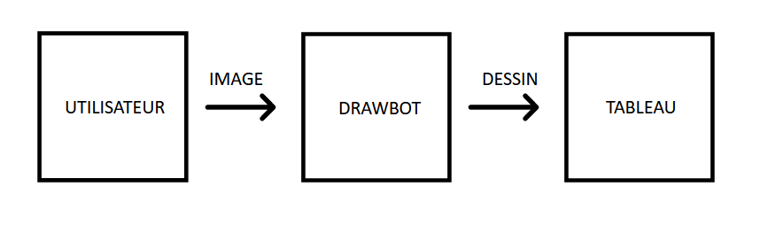
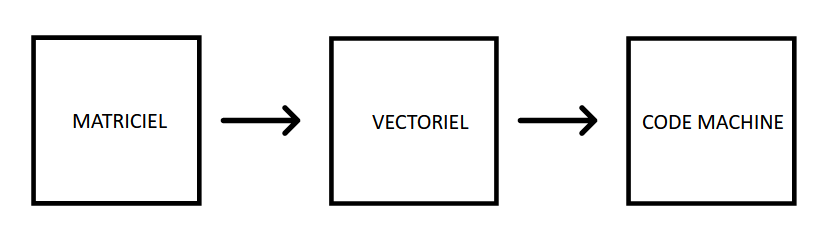
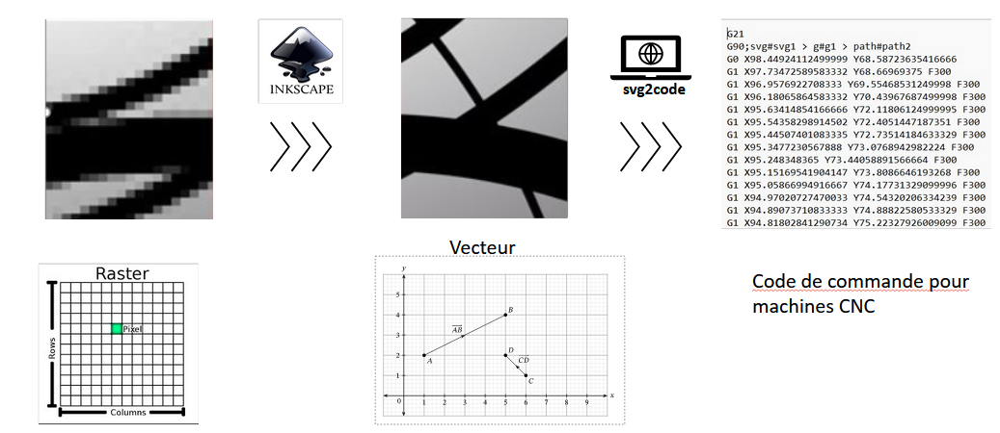

# Image

L'utilisateur souhaite envoyer une image au Drawbot afin que celui-ci dessine sur une surface murale.

Ce dossier contient toutes les instructions et outils afin que l'image soit aux normes pour la partie programmation.

## Principe

L'utilisateur veut reproduire une image en dessin cependant la machine ne comprends pas les mêmes formats d'images que l'Homme.

Nous allons maintenant voir le processus de conversion de l'image en fonction des besoins de l'utilisateur.

Dans ce projet, nous allons manier 3 types d'images : 

1. **matriciel** : PNG, JPG/JPEG, BMP, GIF, WEBP....
2. **vectoriel** : SVG
3. **commande pour machine CNC** : G-code -> GRBL

Le fonctionnement est le suivant :

1. **Conversion d'une image matricielle en vecteur** :

Si votre image est au format matriciel, utilisez un logiciel de vectorisation comme Inkscape pour convertir l'image en format vectoriel (SVG).
Voici deux tutoriels :

 Basique : Simple conversion  -- https://www.youtube.com/watch?v=xAHSGT0D-qg
      
 Avancé : Modification de l'image -- https://www.youtube.com/watch?v=xAHSGT0D-qg

2. **Conversion de l'image vectorielle (SVG) en G-code** :

Une fois que vous avez une image vectorielle au format SVG, utilisez l'outil "svg2code" pour convertir cette image en fichier G-code. Ce fichier G-code contiendra les instructions nécessaires pour que votre drawbot puisse dessiner l'image.

## Schema 

## Ressources supplémentaires

- [Inkscape](https://inkscape.org/)
- [svg2gcode](https://sameer.github.io/svg2gcode/#close)
