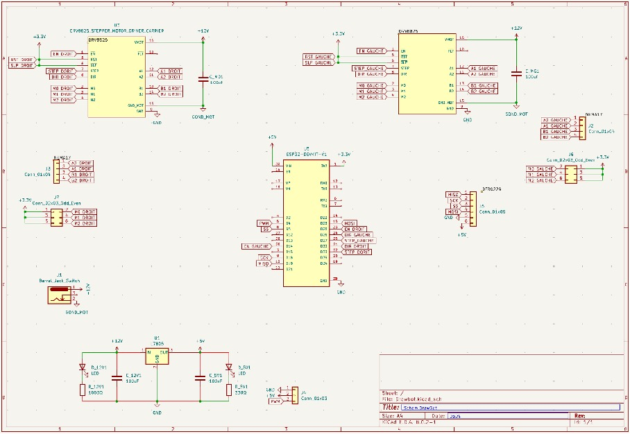
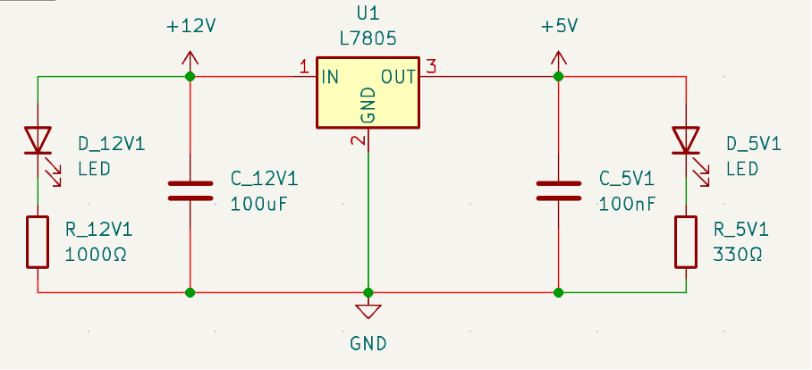
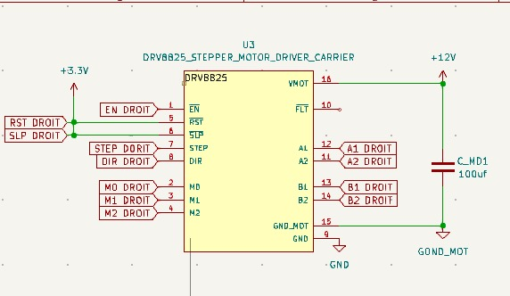
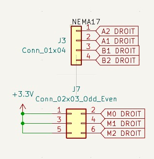

# Carte PCB

## Carte PCB - Schéma électronique

 

 
##Régulateur de tension:

Régulateur de tension, pour pouvoir distribuer du 12V et du 5V en fonction du composant. Deux LED peuvent s’éteindre en cas de dysfonctionnent.

  

## Driver :

1.	Connexions du Moteur
o	A1, A2 - B1, B2 : Bobine A et B du moteur pas à pas

2.	Contrôle du Mouvement avec :
o	STEP : Entrée pour les impulsions de pas qui font avancer le moteur.
o	DIR : Entrée pour définir la direction du mouvement. État haut ou bas pour inverser la direction du moteur.

## Connexions Additionnelles 

Pour notre projet, nous n’utilisons pas ces connexions mais nous laissons cependant à disposition sur la carte PCB en cas de développement du robot :

1.	Contrôle du Microstepping :
o	M0, M1, M2 : Choisir la résolution des pas du moteur pour un mouvement encore plus précis et fluide (très utile pour un drawbot).
M0 = 0, M1 = 0, M2 = 0 : Pas complet (Full step)
M0 = 1, M1 = 0, M2 = 0 : Demi-pas (Half step)
M0 = 0, M1 = 1, M2 = 0 : Quart de pas (Quarter step)
M0 = 1, M1 = 1, M2 = 0 : Huitième de pas (Eighth step)
M0 = 0, M1 = 0, M2 = 1 : Seizième de pas (Sixteenth step)
M0 = 1, M1 = 0, M2 = 1 : Trente-deuxième de pas (Thirty-second step)

1.	EN et RST :
o	ENABLE : Active le driver quand l'entrée est en état bas. Désactive le driver quand en état haut.
o	RESET : Réinitialise le driver. Un état bas réinitialise le driver.

2.	Decouplage et Stabilisation
SLEEP : Met le driver en mode basse consommation pour économiser de l'énergie quand le moteur n'est pas utilisé.

3.	Feedback 
Étant un petit projet, nous n’avons pas brancher FAULT (Indicateur de défautqui passe en état bas si un problème est détecté (surchauffe...) pour réduire le prix de la PCB.

Carte PCB – Routage :

 

Taille des fils :

Pour une application de 5V nous avons utilisé un fil de 20 AWG soit 0.8mm de diamètre ; et un fil de 16 AWG pour le 12V soit d=1,3 mm

Carte et Composants utiles :

Afin d’envoyer le GDCODE, en cas de panne wifi, l’utilisateur pourra tout simplement le transverser via carte micro SD implémenter sur la carte.

Nous avons implémenté sur la carte PCB une alimentation 12V évitant ce genre d’alimentation encombrante :
 

Enfin, cette carte permet aussi d’éviter ce genre de câblage complexe et peu pratique (ne représentant que 1 seul driver) :

 

En quelque mot la carte PCB est un donc petit investissement nécessaire permettant l’ergonomie du robot et un gain de temps pour le câblage.

  
