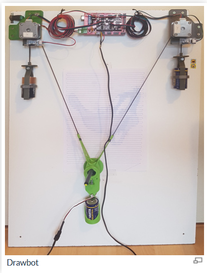
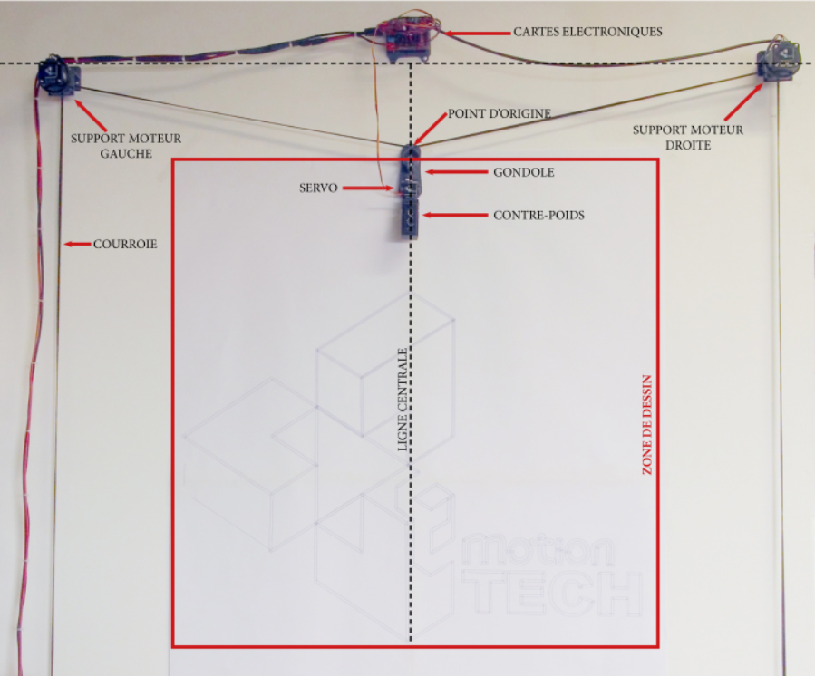
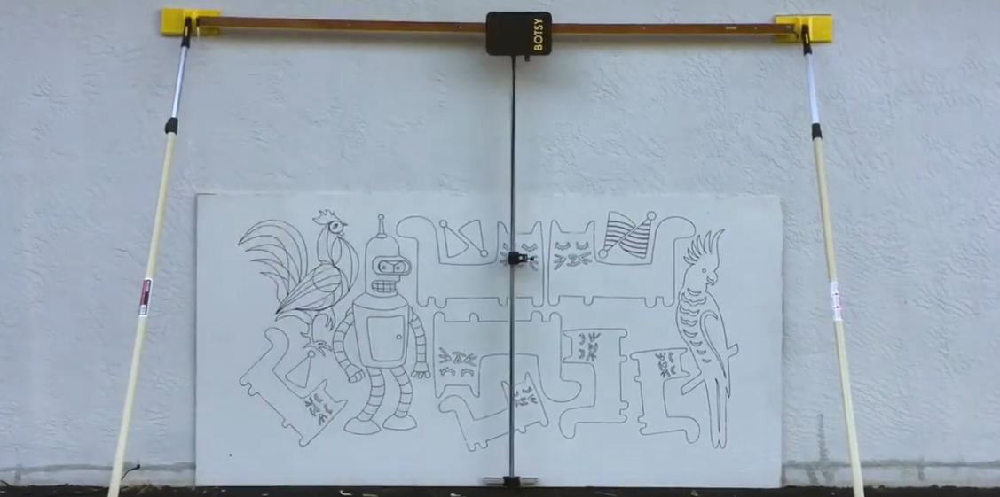
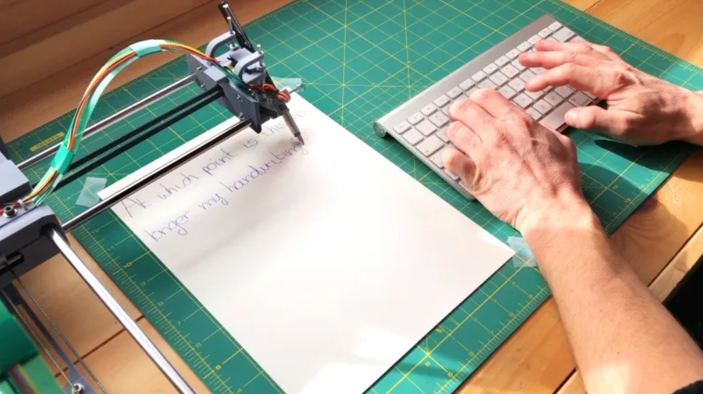
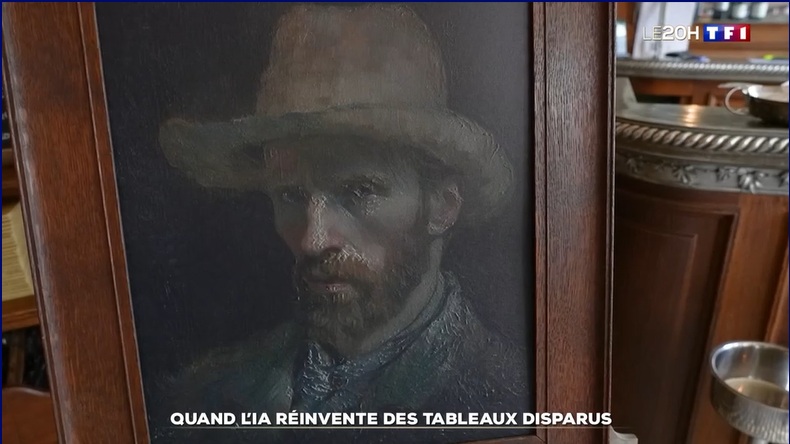

## **Projets Existant**

Plusieurs versions de ce projet ont déjà été développées, cette immense source d'informations nous permettant d'imager notre projet et d'en tirer les meilleurs éléments. Notre version de ce projet vise à innover dans l'efficacité et l'accessibilité, notamment grâce à notre carte ESP32 permettant d'être utilisé via wifi/bluetooth.

Le Drawbot utilise le même système que les fraiseuses ou les imprimantes 3D (avec un axe en plus). Pour comprendre ce système, je vous renvoie à la partie étude technique.

Notre projet n’est pas une innovation, beaucoup d’autres Drawbot ont déjà été conçus avant le nôtre. Il y aura à la fin de cette section tous les liens des autres Drawbot dont nous avons pu nous inspirer.

### **Logiciel et firmware déjà existant pour envoyer le SVG et piloter le robot :**

En cas de manque de temps, de problèmes techniques ou juste comme inspiration, il existe déjà un firmware ainsi qu’un logiciel permettant de piloter un Drawbot Arduino tout en suivant le même principe utilisé par les imprimantes 3D :

https://data.emotion-tech.com/ftp/Datasheets_et_sources/Lab_et_news/Scriboo/eMt_Scriboo_release_1.1.zip

# D’autres Drawbot :

https://www.mydiy.dev/realisations_drawbot.html

 

https://www.reprap-france.com/article/realisez-vous-meme-un-drawbot-scriboo

 

# A plus grande échelle :

**Botsy**, le robot de dessin mural qui permet de réaliser des dessins sur des surfaces verticales telles que des murs. 
Ce robot est très apprécié des artistes et des designers pour sa capacité à transférer et à agrandir des motifs complexes avec précision. 
Il est utilisé pour créer des fresques murales, des décorations intérieures et des projets artistiques sur divers matériaux, comme le verre, le bois, et le métal. Botsy se distingue par sa portabilité et sa facilité d'utilisation, ce qui en fait un outil précieux pour les professionnels cherchant à automatiser et à accélérer le processus de dessin 

https://www.botsy.com/
 

**Plotly, à handwriter robot**

Ce drawbot est conçu pour réaliser des dessins et des tracés complexes avec une grande précision. Utilisé principalement avec des Raspberry Pi, PlottyBot est capable de dessiner des illustrations détaillées sur des surfaces plus grandes, transformant des images numériques en art physique. Ce projet est particulièrement apprécié pour sa flexibilité et sa capacité à traiter des projets artistiques variés, allant des simples croquis aux œuvres complexes​

https://hackaday.com/2022/02/07/plottybot-a-drawbot-that-plots-a-lot/
 

## Actualité

Le 26 mai 2024, sur TF1 pour le 20h une émission est passée au sujet de l'impression 3d et du milieu de l'art, on à pu y voir une multitude de peinture recrées grâce à l'IA.

L'élément phare était un autoportrait de Van Gogh.

C'est une œuvre complétement générée par l'IA, et réalisée par une imprimante 3D : un autoportrait très réaliste, dont l'artiste avait recouvert l'ébauche, faute de moyens pour acheter des toiles.

Citation de l'article :
"Face à une toile supposée de Van Gogh, une visiteuse reste perplexe. "Je me suis dit, c'est le style de Van Gogh, mais je sais que ce n'est pas une de ses toiles parce que je connais un petit peu le peintre, donc, ça m'a intrigué", explique Agathe au micro de TF1. Bien vu de sa part, car l'artiste de ce tableau n'est autre qu'une intelligence artificielle, aidée d'une imprimante 3D"

https://www.tf1info.fr/high-tech/video-reportage-nouvelles-technologies-quand-l-ia-intelligence-artificielle-termine-des-oeuvres-inachevees-de-van-gogh-2300987.html
