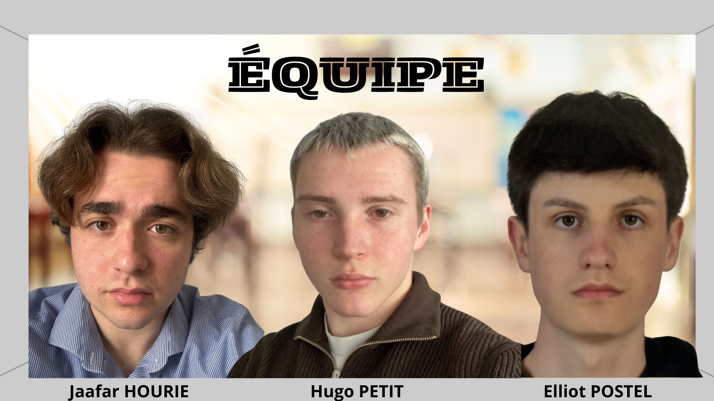

## Répartition des tâches :

Nous avons tous les 3 faits des recherches afin de choisir les bons composants et comprendre le fonctionnement d'un Drawbot.

Après cela, nous nous sommes répartis les tâches comme ceci :

**Jaafar HOURIE** :

Imprimer les supports 3D nécessaires au fonctionnement du drawbot (support central et support moteurs / contrepoids)
 
Cablage de l'ESP32 avec les différents composants

**Elliot POSTEL** :

    
Réalisation du PCB ainsi que de la documentation technique, aide pour le site.

  
**Hugo PETIT** :

Partie Informatique, programmation et conversion de l'image.

Réalisation du site, de la vidéo de présentation et aide pour la doc technique.
