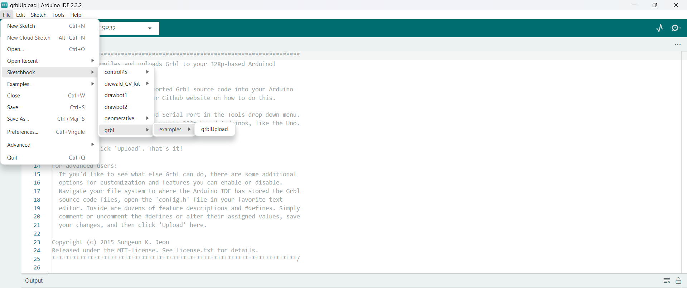
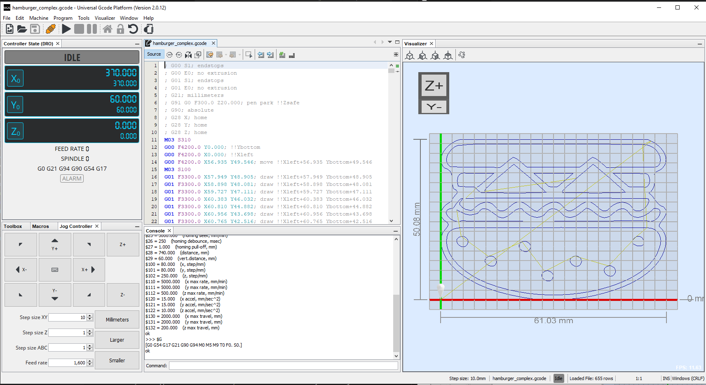
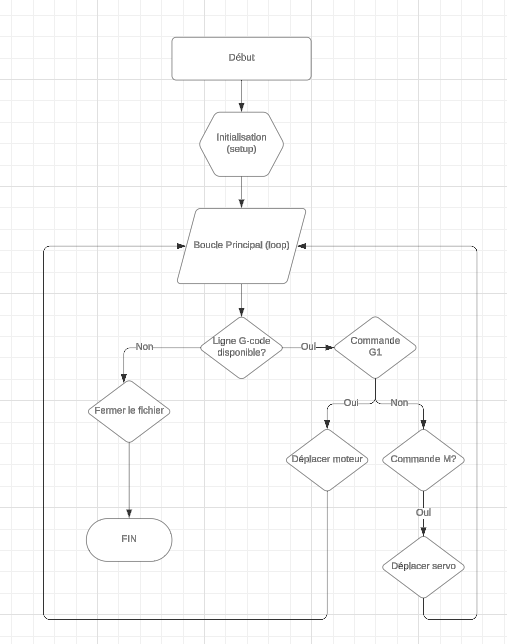

# Programmation

Ce guide explique comment programmer et utiliser le Drawbot pour dessiner.

# Prérequis

Télécharger et installer Universal Gcode Sender (UGS) depuis [ICI](https://winder.github.io/ugs_website/).

Télécharger le firmware GRBL depuis la fork. [ICI](https://github.com/john4242/grbl-polargraph)

S'assurer que l'IDE Arduino est installé à une version supérieur à 1.8. 
Sinon voici un lien pour télecharger la dernière version [ICI](https://www.arduino.cc/en/software).

## Installation du Firmware GRBL sur l'ESP32

1. **Ouvrir l'IDE Arduino :**
      Lancer l'IDE Arduino.

2. **Copier le code source GRBL :**
      Ouvrir le fichier du firmware décompréssé et copier le dossier "grbl"
      Le coller dans le dossier bibliothèque de l'application Arduino : User\home\Documents\Arduino\libraries\grbl

3. **Ouvrir le dossier :**

   Relancer l'IDE Ardnuino.
   (`Ouvrir Fichier > Exemples > grbl > grblUpload`).
   
   
5. **Téléverser le Sketch sur l'ESP32 :**
      Connecter l'ESP32 à votre ordinateu via USB.
      Sélectionner le port série correct (`Outils > Port`).
      Sélectionner la carte ESP32 appropriée (`Outils > Type de carte`).
      Cliquer sur "Téléverser" et attendre la fin du processus.

## Utilisation d'Universal Gcode Sender (UGS)

1. **Lancer UGS :**
    - Lancer le programme.

2. **Charger le Fichier G-code :**
    - Aller dans `File > Open` et sélectionnez le fichier G-code généré précédemment.

3. **Connexion à l'ESP32 :**
    - Sélectionner le port série et la vitesse de connexion (généralement 115200).
    - Cliquer sur "Connect".
4. **Configuration :**

   Régler les paramètres en fonction de vos besoins.
   
   Voici une vidéo explicative : https://www.youtube.com/watch?v=YE-vI5ush2o
   
5.  **Envoyer le Fichier G-code :**
    - Cliquer sur "Send" pour envoyer le fichier G-code au drawbot.
    - Le drawbot commencera à dessiner l'image.
  
## Fonctionnement

Algorigramme représentant le fonctionnement de l'interprete du GRBL dans l'Arduino IDE.

