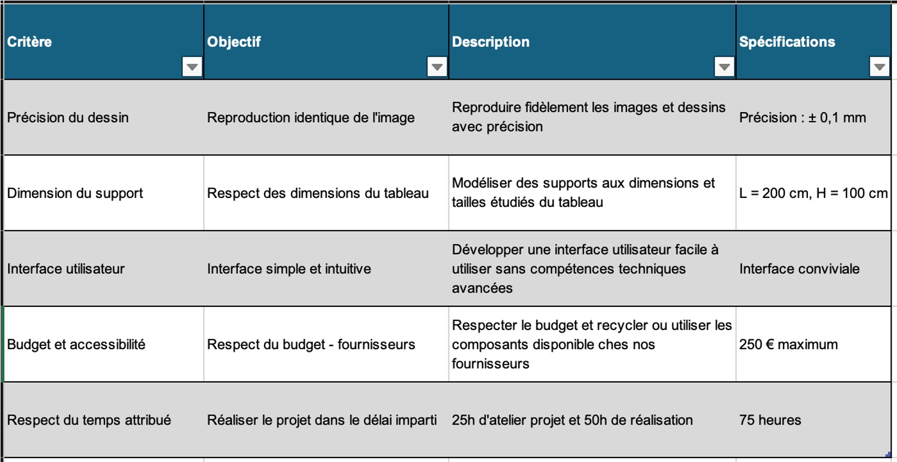
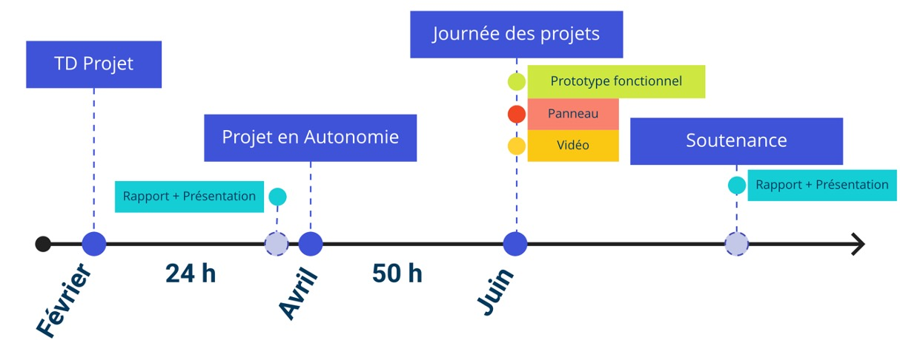

## **Cahier des Charges**

Le Drawbot doit respecter certaines spécifications techniques et fonctionnelles :

# Spécifications Techniques

1.1. **Précision des Dessins**

Précision de Positionnement : ±1 mm
Résolution : Capable de dessiner des détails de 1 mm minimum
Surface de Travail : Adaptable selon le support (mural) 

1.2. **Matériel**

Châssis : Léger et robuste, facile à fixer et à ajuster sur différents types de tableaux 
Moteurs : Pas à pas, pour un contrôle précis du mouvement
Alimentation : Adaptateur secteur avec protection contre les surtensions
Outils de Dessin : Compatible avec différents types de marqueurs (petit ou gros)

1.3. **Comment Dessiner**

Connexion : USB pour le transfert de fichiers 
Image : Format G-code
UGS : Envoie des coordonnées pour que le drawbot dessine.

1.4. **Fonctionnalités**

Calibration Automatique : Système de calibration automatique pour aligner le dessin sur la surface murale (point de départ)
Personnalisation : Options pour ajuster l’épaisseur du trait, la vitesse de dessin ainsi que modifier différentes parties de l'image.

# Contraintes

2.1. **Environnement d’Utilisation**

Intérieur : Conçu principalement pour une utilisation en intérieur
Conditions : Fonctionne dans des conditions de température ambiante (10°C - 35°C)

2.2. **Maintenance**

Facilité d'Entretien : Composants faciles à nettoyer et à remplacer
Support Technique : Documentation détaillée et support technique disponible

# Délais et Budget

3.1. **Délais**

Temps impartis : 75H à lécole pour l'équipe (75x3=225H) + temps perso

3.2. **Budget**

Estimation : 250 €, incluant le matériel, le développement logiciel et les tests

# Conclusion

Le but du drawbot est d’être un appareil précis, fiable et facile à utiliser, capable de transformer des fichiers numériques en œuvres murales avec une grande exactitude. 
