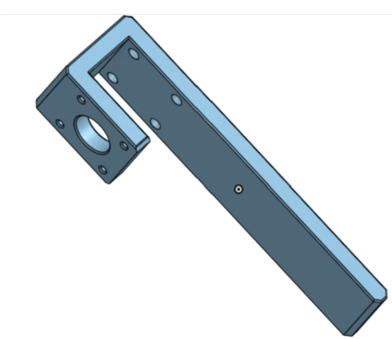
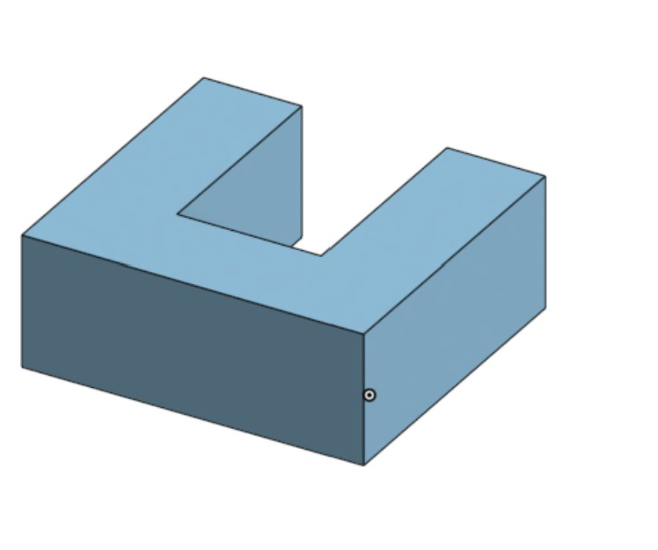
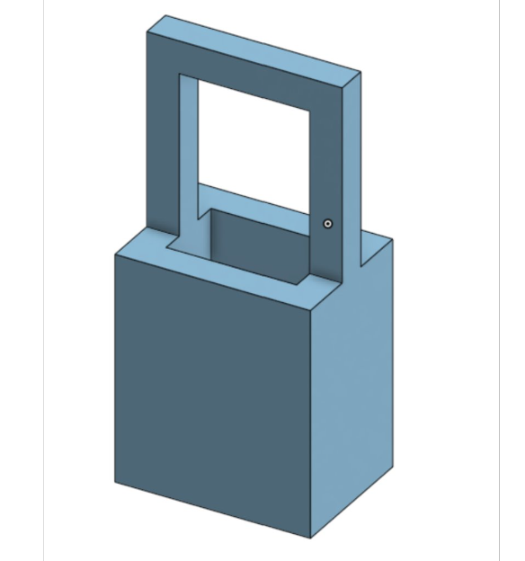
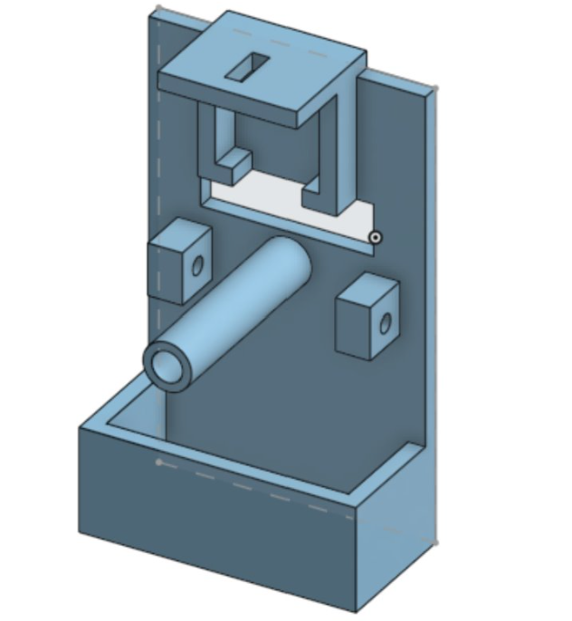
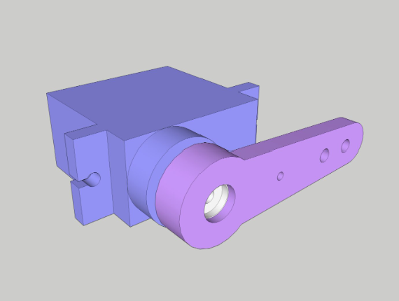
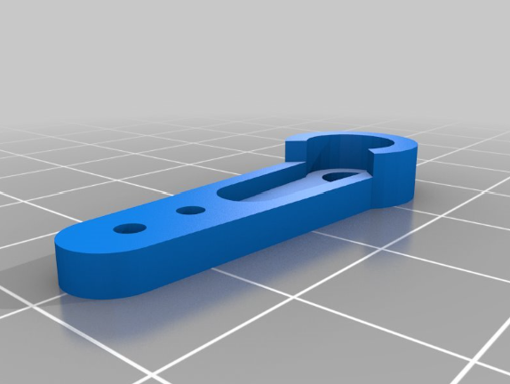

# Conception et prototypage

### **Supports 3D**

**Supports moteurs**

 

Le principe de ce support est de maintenir les moteurs aux deux extrémités en haut du tableau. Afin de ne pas abimer le tableau, nous avons pris soin d’éviter l’utilisation de vis.

C’est un support que nous clipserons sur les deux coins du tableau blanc.

Il est important de souligner que les supports utilisés pour le tableau sont spécifiques et uniques à ce dernier.

Cela représente un inconvénient pour d'autres projets, car chaque nouvelle application du drawbot nécessitera la création et conception de nouveaux supports sur mesure de supports adaptés aux conditions et spécificités de l'endroit où il sera utilisé, ce qui peut limiter la flexibilité du projet.

### **Supports Poids - moteurs**

 

J'ai ensuite modélisé ce support qui sera relié à nos moteurs. Ce support a pour but d'apporter du poids à notre robot et stabiliser ses mouvements. 

Avec ce poids ajouté de chaque côté du tableau, notre robot aura la précision nécessaire pour être le plus fonctionnel possible.

### **Supports stylo - robot**

 

Le stylo doit pouvoir avancer et reculer afin d'écrire ou de se déplacer sans écrire. Pour ce faire, nous avons conçu un mécanisme de coulissement à l'aide d'un servomoteur.

Nous avons ainsi fabriqué un support auquel les courroies seront attachées.

Le stylo pourra être fixé dans un cercle spécifique, avec un système de vis pour le maintenir en place. Cela permet d'assurer une précision optimale lors de l'écriture.

Ce mécanisme garantit que le stylo reste stable et bien aligné, améliorant ainsi la qualité et la précision des dessins réalisés par le drawbot.

Pour notre projet, le servomoteur permet de contrôler si le stylo dessine ou non. Grâce à son bras, le servomoteur peut contrôler le stylo. Lorsque la patte du servo moteur appuie contre le tableau, le stylo est soulevé et ne dessine pas. En revanche,  lorsque la patte du servo moteur est relevée, le stylo touche le tableau et peut donc dessiner.

 

Pour accompagner notre support, j'ai modélisé un support pour la patte de notre servo moteur. Ce support permet d'avoir plus de longueur pour la patte, ce qui nous rend plus précis et fonctionnels. Grâce à ce support, le stylo dessine uniquement lorsque la patte est relevée, et ne dessine pas lorsqu'elle est abaissée.

