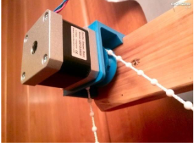
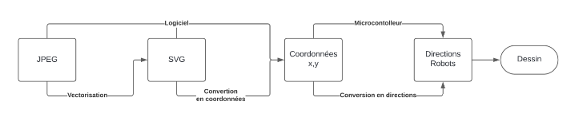
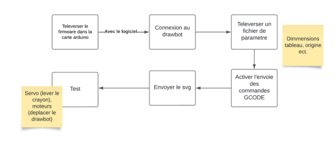
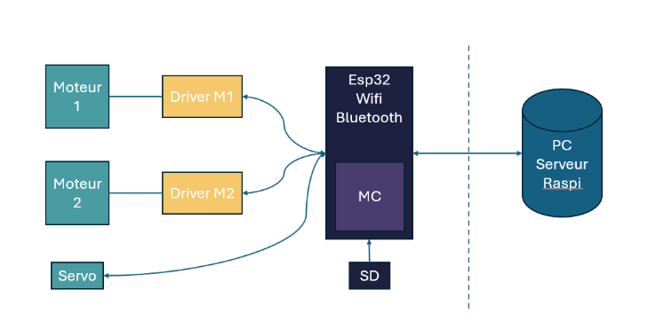

# Études et choix techniques

# Choix techniques :

ESP WROOM 32

Spécificité : La carte fonctionne comme le cerveau du drawbot. Elle contrôlera les
moteurs et recevra les commandes pour dessiner.

Documention : https://docs.arduino.cc/hardware/nano-esp32/#tech-specs

Pourquoi choisir l'ESP32 ?
• Connectivité avancée : L'ESP32 offre une connectivité Wifi et Bluetooth intégrée
grâce au microcontrôleur basé sur le chipset ESP32 - u-blox® NORA-W106
(ESP32-S3)
• Puissance de traitement : La carte est équipée d'un processeur Dual-core, avec
une fréquence pouvant atteindre 240 MHz, offrant d'excellentes capacités de
calcul. Il est plus puissant que de nombreuses autres cartes Arduino, ce qui lui
permet de gérer efficacement les calculs complexes nécessaires au contrôle des
moteurs pas à pas et à d'autres tâches de traitement en temps réel.

A noter :

• L'ESP32 dispose de 14 broches d'E/S, offrant une certaine flexibilité pour une
potentielle extension de notre projet.

# SG90 Servo Moteur

Spécificité : Contrôler le mouvement vertical du marqueur du drawbot.
Fiche technique : https://robotix.ah-oui.org/user_docs/dos11/sg90-data.pdf
Pourquoi choisir le SG90 ?

• Force, précision et fiabilité : Pour lever et baisser le stylo, le sg90 est
suffisamment précis et bien qu’il ne soit pas le servo moteur le plus puissant, la
force qu’il peut fournir est largement suffisante.

• Taille compacte : Le SG90 est plus petit et plus léger que le servo moteur
MG996R, ce qui le rend plus adapté à notre drawbot avec ses déplacements où
la taille et le poids sont à prendre en compte.

• Prix : Le SG90 est l'un des servos moteurs les moins chers disponibles sur le
marché. Prix unitaire : ± 1 euro.

# Moteurs NEMA 17

Spécificités : Déplacer le drawbot les axes X et Y.

En savoir plus - Datasheet : https://www.robot-maker.com/shop/moteurs-et-
actionneurs/14-moteur-pas-a-pas-nema-17-14.html

Pourquoi choisir des moteurs NEMA 17 ?

• Couple, précision : Il offre un bon équilibre entre taille et puissance, idéal pour
déplacer le stylo et le support avec précision sur toute la surface de dessin.

• Fiabilité et durabilité : Robustes et fiables il est adapté à une utilisation à long
terme pour notre projet.

Pourquoi pas à pas : Les moteurs pas à pas avancent par incréments précis à
chaque impulsion électrique, ce qui facilite la gestion du positionnement et du
mouvement du stylo.

# Driver moteur DRV8825

Spécificités Utilisé pour alimenter et contrôler les moteurs pas à pas à partir de
l'Arduino.

Documentation : https://www.ti.com/product/DRV8825#params

Pourquoi choisir des moteurs DRV8825 ?

• Puissance : Le DRV8825 peut fournir suffisamment de courant pour alimenter nos
moteurs pas à pas.

• Contrôle précis : Il offre des options de micro-pas pour un contrôle précis du
mouvement.

• Fiabilité : Il est connu pour apporter une performance très fiable.

# Courroies et poulies (GT2) :

Spécificité : Transmettent le mouvement entre les moteurs et les axes X et Y.

• Fiabilité : Les courroies et poulies GT2 sont choisies pour leur fiabilité et leur
durabilité, garantissant un fonctionnement stable et sans accroc du drawbot
pendant de longues périodes.

• Faible jeu : Minimum de jeu et de retard, assurant un mouvement fluide et régulier
du drawbot sans secousses ni à-coups.

Plus précis que ce genre de courroies.

# Alimentation :

Rôle : Alimenter le drawbot
Regulateur de tension 5V pour la carte ESP32
PJ-102B : prise jack pour recevoir le courant
Secteur 12V

# Support 3D
Spécificités : Châssis du robot et fixation pour les moteurs.

# Logiciels et outils :
Logiciel de conversion d'image : Pour convertir les images JPEG en fichiers SVG,
nous allons utiliser Inkscape. (Amelioration : linclure sur une surface direct au robot)
L'IDE Arduino : utilisé pour écrire, compiler et téléverser le G-Code sur la carte
ESP32.
On Shape et SolidWorks : Logiciel de modélisation 3D pour les support
ShareX : Screenshoot professionnalisés des modélisations 3D
Kicad : Logiciel de réalisation de circuit imprimé
FluidNC : Firmware optimisé pour l’ESP32, intégre une Interface Utilisateur au projet
( WIFI )

# Etudes :
# Mécanisme partie microcontrôleur:
Le mécanisme du Drawbot repose sur un processus assez simple mais bien établi,
similaires à des principes utilisés dans les imprimantes 3D. Pour mieux comprendre
son fonctionnement, voyons les différentes étapes du processus :

# 1 - Conversion d'image JPEG en SVG :
Le processus débute par l'envoi d'une image sous format JPEG. Cette image
est ensuite convertie en un fichier SVG (Scalable Vector Graphics) pour la
vectoriser.

Contrairement aux images JPEG qui sont basées sur des pixels qui sont
fusionnés en une seule image, les fichiers SVG sont basés sur des vecteurs et
conservent les informations sur chaque élément graphique séparément, tels
que les lignes, les courbes, les formes, etc.

Ainsi, en convertissant l'image en SVG, le DrawBot peut suivre précisément
les contours et les formes lors du dessin et le reproduire encore une fois
précisément sur le tableau.

# 2 - Analyse du SVG :
Une fois convertie en SVG, l'image est analysée pour extraire les coordonnées
x,y des trajectoires de dessin. Elles représentent les contours des formes et
des lignes dans l'image, et serviront à guider le DrawBot lors du dessin.

# 3 - Transmission des coordonnées au microcontrôleur :
Les coordonnées extraites sont ensuite transmises au microcontrôleur qui
traitera les instructions reçues et de contrôlera les moteurs et le servomoteur
pour effectuer le dessin.

# 4 - Génération des instructions de mouvement :
En fonction des coordonnées reçues, le microcontrôleur génère une séquence
d'instructions de mouvement. Ces instructions déterminent précisément où le
DrawBot doit se déplacer sur le mur et à quelle vitesse, ainsi que quand il doit
lever ou abaisser le stylo pour dessiner.

# 5 – Le dessin :
En suivant les instructions générées, le DrawBot effectue les mouvements
nécessaires pour reproduire le dessin sur le mur. Cela implique le
déplacement précis du DrawBot sur toute la surface du tableau mural, ainsi
que le contrôle du mécanisme de levage du stylo pour le positionner
correctement en fonction des besoins du dessin.

# Utilisation du G-Code - Pour les imprimantes 3D :
Le langage de programmation utilisé pour contrôler le mouvement des
imprimantes 3D est souvent le G-Code. Un langage de programmation à
contrôle numérique composé d'une série de commandes appelées G-Code.
La plupart de ces commandes commencent par un G (d'où le nom G-code).

# Logiciel et firmware pour envoyer le svg et piloter le robot :

Voici un schéma pour expliquer simplement comment cela fonctionne :

# Etude du robot partie dessin:

Gcode dans la sd – plus tard par wifi …
Moteur tourne pour faire bouger le robot
Servo sactive pour avancer ou reculer le stylo – écrire ou non

# Etude branchement et technique – carte kicad
Regulateur +image
Driver ou les pates sont connectées et pk + pk condo
Servo IDEM
Screen schema et footprints de kicad…

