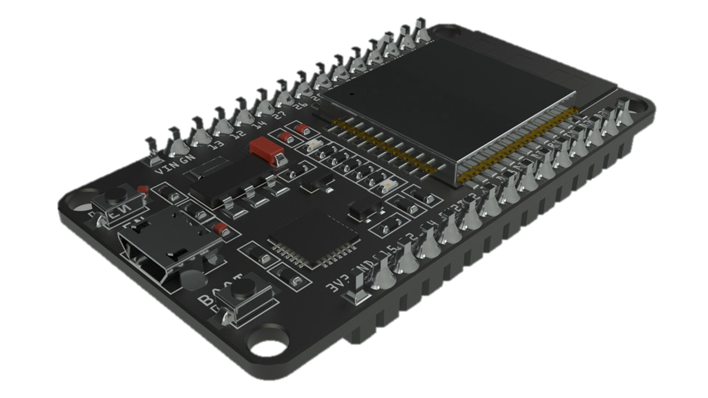
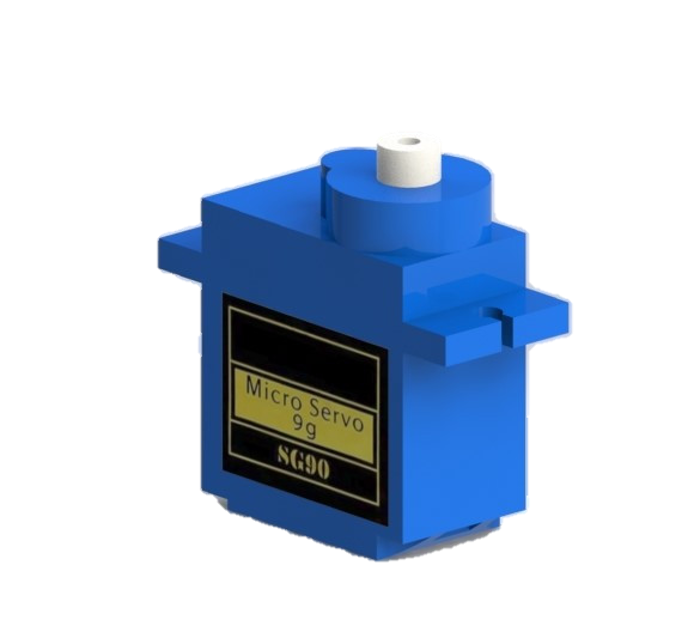
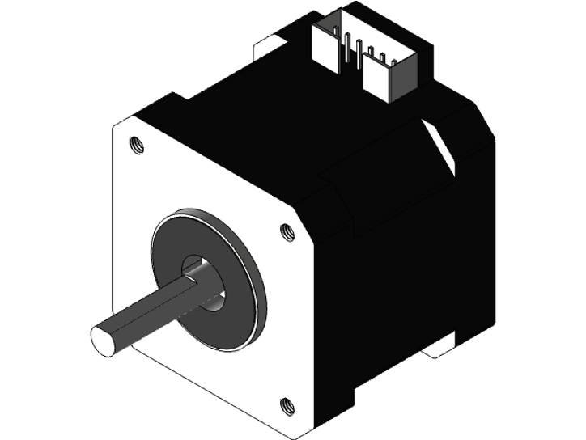
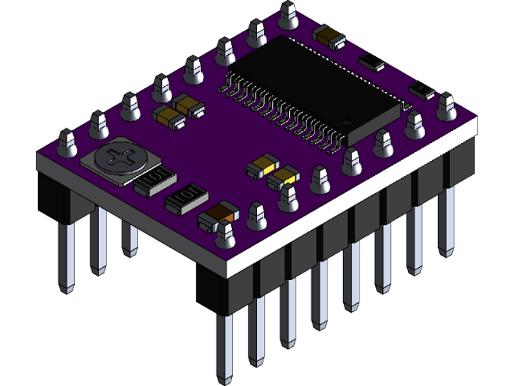
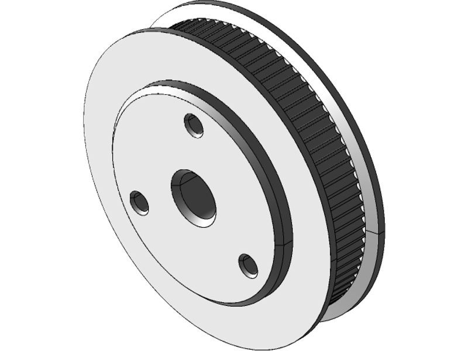
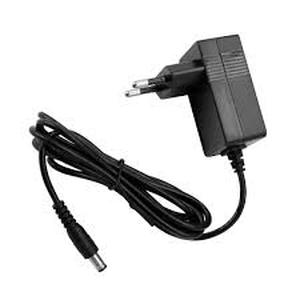
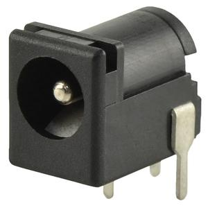
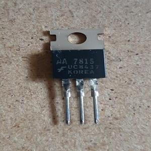

# Études et choix techniques

## Choix techniques

### **Module - ESP-WROOM-32**

**Role pour le drawbot :**  
La carte fonctionne comme le cerveau du drawbot. Elle contrôlera les moteurs et recevra les commandes pour dessiner.

**Documentation :**  
[ESP32 Tech Specs](https://docs.arduino.cc/hardware/nano-esp32/#tech-specs)

**Pourquoi choisir l'ESP32 ?**

- **Connectivité avancée :**  
  L'ESP32 offre une connectivité Wifi et Bluetooth, des focntionnalitées intéréssantes pour envoyer nos GCODES.

- **Puissance de traitement :**  
  La carte est équipée d'un processeur Dual-core (fréquence de 240 MHz). Il permet non-seulement de gérer efficacement les calculs complexes nécessaires au contrôle des moteurs pas à pas mais aussi le multitache où d'autres tâches de traitement en temps réel.

**À noter :**

- L'ESP32 dispose de 14 broches d'E/S, offrant une certaine flexibilité pour une potentielle extension du drawbot. Notamment pour le microstrepping offert par les broches M0, M1 et M2 que nous n'utilisons pas pour notre projet.

### **Servo Moteur - SG90**

**Role pour le drawbot :**  
Contrôler le mouvement vertical du marqueur.

**Fiche technique :**  
[SG90 Datasheet](https://robotix.ah-oui.org/user_docs/dos11/sg90-data.pdf)

**Pourquoi choisir le SG90 ?**

- **Force, précision et fiabilité :**  
  Pour lever et baisser le stylo, le SG90 est suffisamment précis et bien qu’il ne soit pas le servo moteur le plus puissant, la force qu’il peut fournir est largement suffisante.

- **Taille compacte :**  
  Le SG90 est plus petit et plus léger que le servo moteur MG996R, ce qui le rend plus adapté à notre drawbot avec ses déplacements où la taille et le poids sont à prendre en compte.

- **Prix :**  
  Le SG90 est l'un des servos moteurs les moins chers disponibles sur le marché, avec un prix unitaire d'environ 1 euro.

### **Moteurs - NEMA 17**

**Role pour le robot :**  
Déplacer le drawbot sur les axes X et Y.

**En savoir plus :**  
[NEMA 17 Datasheet](https://www.robot-maker.com/shop/moteurs-et-actionneurs/14-moteur-pas-a-pas-nema-17-14.html)

**Pourquoi choisir des moteurs NEMA 17 ?**

- **Pourquoi choisir des moteurs pas à pas ?**  
Les moteurs pas à pas avancent par incréments précis à chaque impulsion électrique, ce qui facilite la gestion du positionnement et du mouvement du stylo.

- **Couple et précision :**  
  Ils offrent un bon équilibre entre taille et puissance, idéal pour déplacer le stylo et le support avec précision sur toute la surface de dessin.

- **Fiabilité et durabilité :**  
  Robustes et fiables, ils sont adaptés à une utilisation à long terme pour notre projet.
  
- **Microtepping :**
  Améliore la performance globale des moteurs pas à pas en réduisant les vibrations et le bruit, en améliorant la précision du positionnement, en réduisant les à-coups et en optimisant l'efficacité énergétique.

  
### **Driver moteur DRV8825**

**Role pour le robot :**  
Utilisé pour alimenter et contrôler les moteurs pas à pas à partir de l'Arduino.

**Documentation :**  
[DRV8825 Datasheet](https://www.ti.com/product/DRV8825#params)

**Pourquoi choisir des drivers DRV8825 ?**

- **Puissance :**  
  Le DRV8825 peut fournir suffisamment de courant pour alimenter nos moteurs pas à pas.

- **Contrôle précis :**  
  Il offre des options de micro-pas pour un contrôle précis du mouvement.

- **Fiabilité :**  
  Il est connu pour apporter une performance très fiable.

### **Courroies et poulies (GT2)**

**Spécificité :**  
Transmettent le mouvement entre les moteurs et les axes X et Y.

- **Fiabilité :**  
  Les courroies et poulies GT2 sont choisies pour leur fiabilité et leur durabilité, garantissant un fonctionnement stable et sans accroc du drawbot pendant de longues périodes.

- **Faible jeu :**  
  Minimum de jeu et de retard, assurant un mouvement fluide et régulier du drawbot sans secousses ni à-coups.

### **Alimentation**

**Rôle :**  
Alimenter le drawbot

- **Régulateur de tension 5V :** Pour la carte ESP32.
- **PJ-102B :** Prise jack pour recevoir le courant.
- **Secteur 12V**

### **Support 3D**

LIEN POUR RENVOYER A LA PARTIE SUPPORTS 3D

## Logiciels et outils

-  **Inkscape :**  
  Pour convertir les images JPEG en fichiers SVG, nous allons utiliser Inkscape (amélioration : l'inclure sur une surface directe au robot).

-  **L'IDE Arduino :**  
  Utilisé comme interprète du G-Code sur la carte ESP32.

-  **On Shape :**
  Logiciel de modélisation 3D pour les supports.

-  **ShareX :**  
  Capture d'écran professionnelle pour le projet.

-  **KiCad :**  
  Logiciel de réalisation de circuit imprimé.

-  **UGS :**  
  Logiciel pour envoyer des fichiers G-code aux machines CNC, avec une interface utilisateur intuitive pour contrôler le Drawbot via USB.

## Études

### **Mécanisme partie microcontrôleur**

Le mécanisme du Drawbot repose sur un processus bien établi, similaire aux principes utilisés dans les imprimantes 3D.

Pour mieux comprendre son fonctionnement, voyons les différentes étapes du processus :

1. **Conversion d'image matriciel en image vectoriel :**

    - Le processus débute par l'envoi d'une image sous format JPEG. Cette image est ensuite convertie en un fichier SVG (Scalable Vector Graphics) pour la vectoriser.
    - Contrairement aux images matricielles (PNG/JPEG..) basées sur des pixels fusionnés en une seule image, les fichiers vectoriels (SVG) sont basés sur des vecteurs et conservent les informations sur chaque élément graphique séparément, tels que les lignes, les courbes, les formes, etc.
    - Ainsi, en convertissant l'image en SVG, le DrawBot peut suivre précisément les contours et les formes lors du dessin et les reproduire fidèlement sur le tableau.

2. **Conversion d'image vectoriel en coordonnées machine :**

    - Une fois convertie en SVG, l'image est convértie en coordonnées x,y des trajectoires de dessin.
    - Ces coordonnées représentent les contours des formes et des lignes dans l'image et serviront à guider le DrawBot lors du dessin.

3. **Transmission des coordonnées au microcontrôleur :**

    - Les coordonnées extraites sont ensuite transmises au microcontrôleur qui traitera les instructions reçues et contrôlera les moteurs et le servomoteur pour effectuer le dessin.

4. **Génération des instructions de mouvement :**

    - En fonction des coordonnées reçues, le microcontrôleur génère une séquence d'instructions de mouvement.
    - Ces instructions déterminent précisément où le DrawBot doit se déplacer sur le mur et à quelle vitesse, ainsi que quand il doit lever ou abaisser le stylo pour dessiner.

5. **Le dessin :**

    - En suivant les instructions générées, le DrawBot effectue les mouvements nécessaires pour reproduire le dessin sur le mur.
    - Cela implique le déplacement précis du DrawBot sur toute la surface du tableau mural, ainsi que le contrôle du mécanisme de levage du stylo pour le positionner correctement en fonction des besoins du dessin.

### **Utilisation du G-Code pour les imprimantes 3D**

Le langage de programmation utilisé pour contrôler le mouvement des imprimantes 3D est souvent le G-Code. Il s'agit d'un langage de programmation à contrôle numérique composé d'une série de commandes appelées G-Code. La plupart de ces commandes commencent par un G (d'où le nom G-code).

### **Logiciel et firmware pour envoyer le SVG et piloter le robot**

Voici un schéma pour expliquer simplement comment cela fonctionne :

### **Étude du robot partie dessin**

- **G-Code dans la SD :** Plus tard par WiFi.
- **Moteur :** Tourne pour faire bouger le robot.
- **Servo :** S'active pour avancer ou reculer le stylo, permettant d'écrire ou non.

### **Étude branchement et technique – carte KiCad**

LIEN POUR RENVOYER A KICAD
