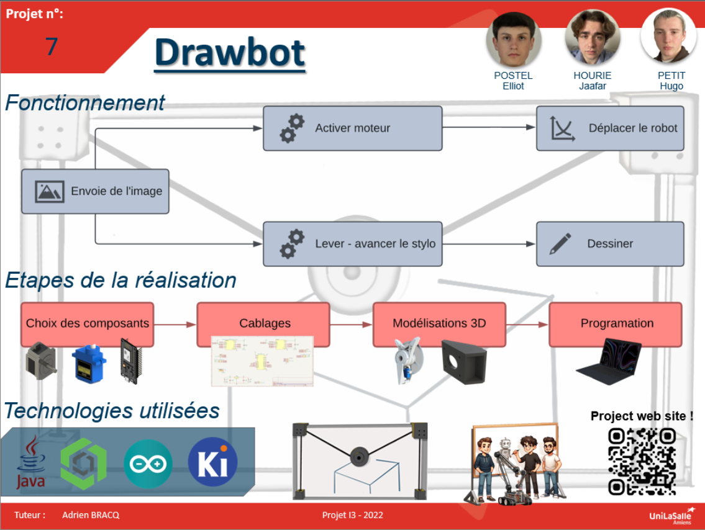

# Bienvenue sur notre documentation

Bienvenue dans la documentation du projet Drawbot. Ce site a pour but de fournir toutes les informations nécessaires pour comprendre, utiliser et même reproduire et améliorer efficacement notre projet.

## À propos du Projet - Le DRAWBOT

Notre projet combine la technologie au dessin, le but est de mettre au point un robot mural. Le DrawBot sera capable de dessiner sur des murs n’importe quelle image envoyée par l’utilisateur grâce à un logiciel.

Notre projet ayant pour but d’être repris et amélioré, aura des fonctionnalités supplémentaires intéressantes. Il aura par exemple une connectivité Wi-Fi et Bluetooth permettant à l’utilisateur d’utiliser le DrawBot à distance.

En ce qui concerne notre équipe, elle est composée de 3 étudiants en troisième année d’école d’ingénieurs.  Nous avons donc tous les trois des compétences quasi similaires, allant de la conception mécanique à la programmation.

Enfin, notre engagement pour ce projet c’est d’abord de mettre en place un robot fonctionnel, mais aussi de le rendre accessible en le documentant au plus possible afin qu’une autre équipe le reprenne et l’améliore.

## Poster

## Vidéo

Ici vous publierez la vidéo de votre projet. 
- Moins de 1min30
- Présentation du projet 
- Des explication du fonctionnement du projet
- Des vues du projet / Prototype / Application etc... 
- Des plans du fonctionnement (même basique ou des éléments séparés)
- Une conclusion
Si en stockage local : >50mo

<video src="images/intro_amiens.mp4" controls title="Title"  style="width: 100%;"></video>

---
