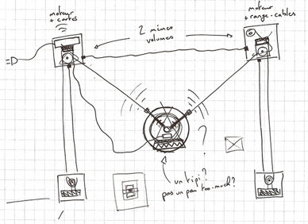
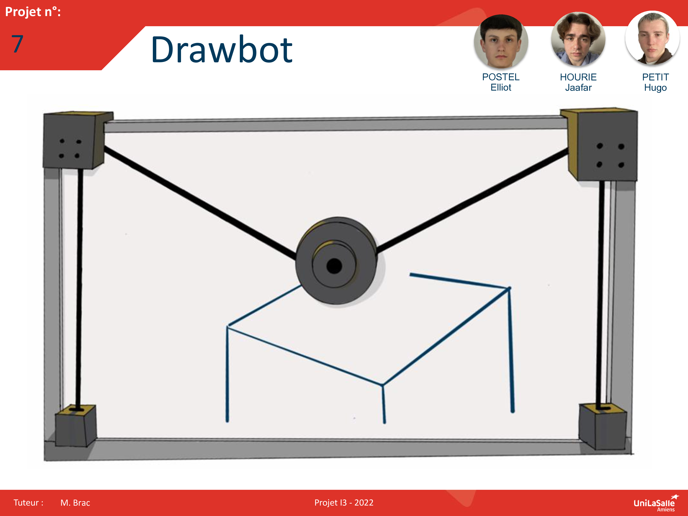

# Bienvenue sur notre documentation

Bienvenue dans la documentation du projet Drawbot. Ce site a pour but de fournir toutes les informations nécessaires pour comprendre, utiliser et reproduire efficacement notre projet.

## À propos du Projet

Notre projet vise à fusionner l'art et la technologie en développant un robot mural capable de transformer des images en dessins mureaux grâce à un logiciel. 
Grâce à la carte Arduino ESP32 notre drawbot aura une fonctionnalité supplémentaire des autres projets drawbot que l'on peut voir sur le net. En effet, il aura en plus d'une connéctivité similaire aux autres drawbot, une connéctivité WiFi et Bluetooth permettant à l'utilisateur d'utiliser le drawbot à distance.

Notre équipe, composée de 3 étudiants en école d'ingénieur, apporte une multitude de visions avec des compétences quasi-similaire, allant de la conception mécanique à la programmation, unis par une passion par le désir de créer le drawbot de nos idées. Notre engagement se porte sur la création d'un outil à la fois accessible et innovant, destiné à élargir les horizons de l'expression créative et à introduire des concepts de robotique de manière interactive et engageante.

Ce projet illustre l'essort de la programmation, en particulier sa collaboration possible avec la machine en offrant un nouveau moyen de dessin pour l'art mural.

## Poster

Ici vous publierez le poster de votre projet.

## Vidéo

Ici vous publierez la vidéo de votre projet. 
- Moins de 1min30
- Présentation du projet 
- Des explication du fonctionnement du projet
- Des vues du projet / Prototype / Application etc... 
- Des plans du fonctionnement (même basique ou des éléments séparés)
- Une conclusion
Si en stockage local : >50mo

<video src="images/intro_amiens.mp4" controls title="Title"  style="width: 100%;"></video>

---
