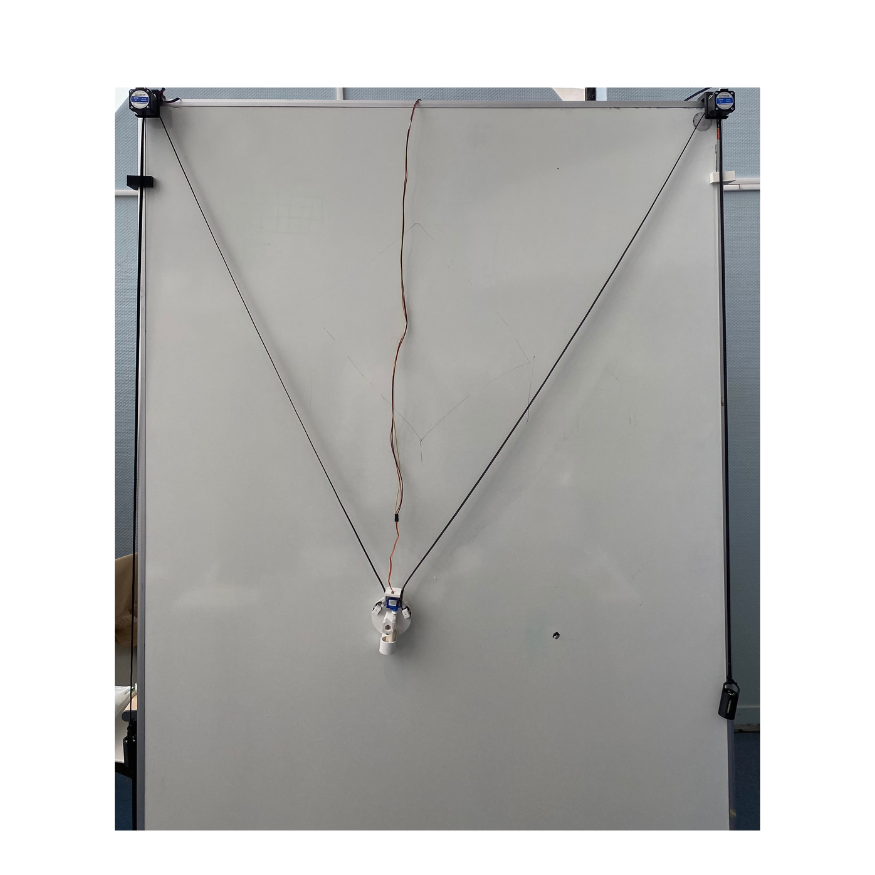

# Bienvenue sur notre documentation

Bienvenue dans la documentation du projet Drawbot. Ce site a pour but de fournir toutes les informations nécessaires pour comprendre, utiliser et même reproduire et améliorer efficacement notre projet.

 

## **À propos du Projet - Le DRAWBOT**

Notre projet combine la technologie au dessin, le but est de mettre au point un robot mural. Le DrawBot sera capable de dessiner sur des murs n’importe quelle image envoyée par l’utilisateur grâce à un logiciel.

Notre projet ayant pour but d’être repris et amélioré, aura des fonctionnalités supplémentaires intéressantes. Il aura par exemple une connectivité Wi-Fi et Bluetooth permettant à l’utilisateur d’utiliser le DrawBot à distance.

En ce qui concerne notre équipe, elle est composée de 3 étudiants en troisième année d’école d’ingénieurs. Nous avons donc tous les trois des compétences quasi similaires, allant de la conception mécanique à la programmation.

Enfin, notre engagement pour ce projet c’est d’abord de mettre en place un robot fonctionnel, mais aussi de le rendre accessible en le documentant au plus possible afin qu’une autre équipe le reprenne et l’améliore.

## **Poster**

## **Vidéo**

<video src="images/video_new.webm" controls="controls" title="Title" style="width: 100%;"></video>

## **Remerciements**

Nous tenons à exprimer notre gratitude à plusieurs personnes sans qui ce projet n'aurait pas été possible :

**Adrien BRACQ**  : *Responsable du Makerspace d'Unilasalle Amiens et Enseignant-Chercheur*

**Guy CHAUMIER** : *Ingénieur d'études*

**Marie-Christine PETIT** : *Responsable Formation Humanités et Entreprise*

Leur aide technique et organisationnelle a été essentielle pour structurer et mener à bien notre projet. Leur soutien précieux a été constant tout au long de notre démarche, depuis l'organisation initiale jusqu'à la conception finale. 

Leurs conseils avisés nous ont permis de concrétiser nos ambitions et de créer un projet dont nous sommes fiers.

Nous leur adressons nos plus sincères remerciements.

---
