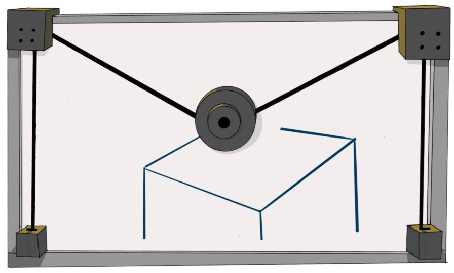
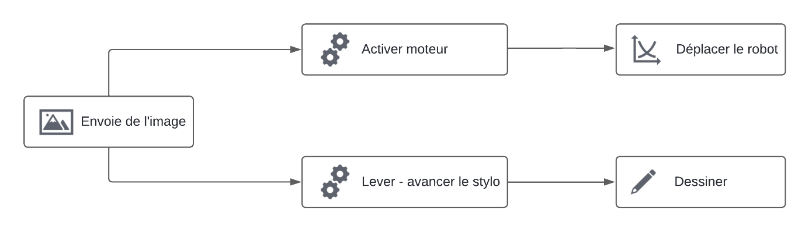
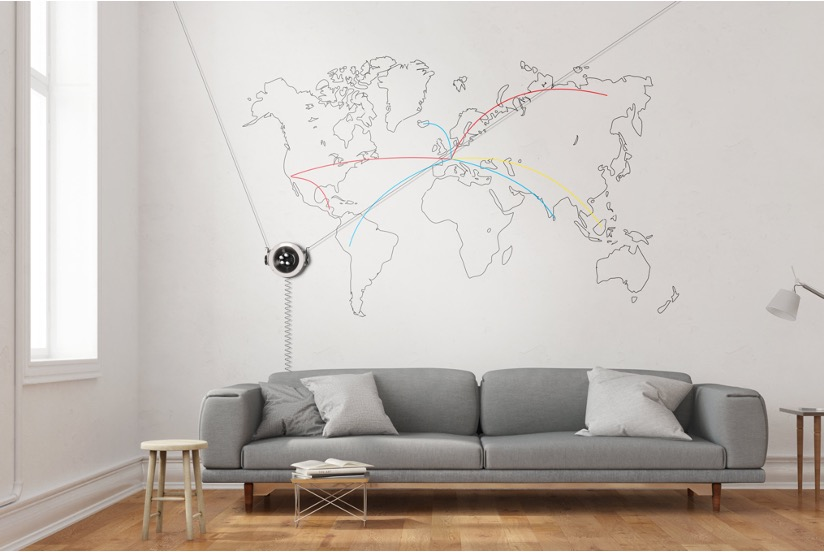

## Introduction

Nous sommes trois étudiants en troisième année d'école d'ingénieur à UniLaSalle Amiens, et pour notre projet de fin d'année, nous avons choisi de concevoir un Drawbot mural.

Il s'agit d'un robot conçu pour dessiner de manière automatisée sur une surface verticale.

Son fonctionnement repose sur 2 systèmes simples :

- **La navigation :** Basée sur deux moteurs qui permettent le déplacement du robot sur toute la surface du tableau.
- **Le dessin :** Le Drawbot utilise un mécanisme de rouage pour contrôler le stylo. Le robot peut ainsi avancer ou reculer le stylo selon les besoins du dessin.

Outre le fonctionnement du robot, son utilisateur pourra le contrôler de manière simple depuis une interface utilisateur.

Pour donner une utilité du projet à plus grande échelle, comme dans la pub, l’art ou même dans la décoration en architecture, un Drawbot plus grand et avec de nombreux capteurs pourrait créer des œuvres précises sur de grandes surfaces. Comme peindre des motifs sur des surfaces de maisons (intérieures - extérieures) et d’autres encore.

C’est donc un projet à petite échelle qui a néanmoins le même principe et le même fonctionnement qu’un vrai robot utilisable par des professionnels.

En tant qu’étudiants en ingénierie, ce projet présente donc plusieurs aspects intéressants :

Tout d’abord, c’est une occasion d’appliquer les connaissances théoriques acquises au cours de nos études en pratique. La conception et la réalisation vont nous favoriser la maîtrise de nos compétences en électronique et en programmation.

Le projet nous permettra aussi de développer nos compétences en travail d’équipe, en gestion de projet et en résolution de problèmes. En tant que futurs ingénieurs, ce sont des compétences dont nous aurons le plus besoin à l’avenir.

On a également pu élargir notre vision de l’impact de la technologie sur la société et donné un sens au projet à cette petite échelle.

La conception de ce Drawbot mural est une occasion d’appliquer nos compétences techniques et de travail d’équipe, développer notre esprit innovateur d’ingénieur, et nous préparer aux défis de notre future carrière d’ingénieur, que ce soit comme technicien ou manager.
